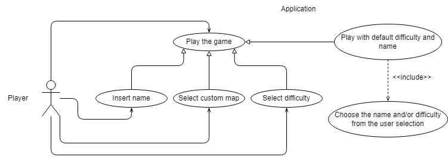

# Requisiti

## Requisiti di business
Come progetto ci si è proposti di replicare un gioco che fosse realizzabile nel tempo specificato nelle regole d'esame,
ovvero 60-80 ore di lavoro individuale, per la realizzazione dell'applicazione abbiamo imposto i seguenti requisiti:
1. L'applicazione sviluppata deve avere un giusto livello di complessità, deve dimostrare l'apprendimento delle
   conoscenze acquisite durante il corso e rientrare nel monte ore prestabilito.
2. Il gioco deve essere sviluppato in modo che, partendo da uno stato iniziale funzionante, si riesca ogni volta a
   creare nuovi blocchi di funzionalità e mano a mano unirli allo stato iniziale.
3. La componente grafica deve essere il più semplice possibile ma allo stesso tempo l'architettura deve rispettare i
   vincoli imposti dalla programmazione ad oggetti.

Tra le proposte ottenute, inizialmente si era pensato di realizzare un'applicazione per gestire gli orari dei treni di
Trenitalia, il problema che abbiamo riscontrato ad un certo punto dello sviluppo è stato il fatto che non si adoperavano
nella maniera corretta le conoscenze acquisite durante il corso.
Per questo motivo si è deciso di optare quella che era inizialmente la seconda scelta, ovvero un gioco basato sul
modello del "Tower Defense". Facendo un buona buona progettazione il secondo punto risulta molto semplice da realizzare,
in quanto il gioco di base non presenta nessuna grossa difficoltà a livello implementativo.

Il gioco di per se è molto semplice: è composto da una serie di ondate di nemici, che attraversano una mappa e il gioco
termina quando un certo numero di nemici raggiungono il traguardo; l'obiettivo del giocatore è impedire ai nemici di
attraversare la mappa, creando delle torri che a loro volta spareranno ai nemici nel loro raggio.

## Requisiti utente
Un utente esige di poter fare le seguenti operazioni.

### Giocare un livello
Il giocatore vuole che l'esperienza di gioco sia esattamente come quella di un qualunque "Tower Defense",
quindi vuole:
* avere a disposizione le torri (almeno quelle che si può permettere con i crediti che possiede)
* vedere, una volta iniziata la wave, come i nemici attraversano il percorso per essere uccisi o arrivare a destinazione
* fare click and place delle torri per posizionarle nella griglia di gioco
* resettare il game e incominciare a giocare nuovamente dal punto di partenza
* avere la possibilità di ritornare al menu iniziale
* avere la possibilità di passare alla wave successiva, nel caso ne esista una e quella corrente sia conclusa
* avere la possibilità di chiudere il gioco

### Creare una mappa
Creare una mappa custom, caricandola attraverso un file, e, se possibile, generarla direttamente dal gioco.

### Menu principale
L'utente, nella schermata di gioco, vuole:
* selezionare il livello di difficoltà desiderato
* inserire il proprio nickname
* aggiungere una mappa custom
* iniziare il gioco con le impostazioni specificate
* uscire dal gioco

## Requisiti funzionali
A partire dai requisiti utente, sono stati formulati i seguenti requisiti funzionali:
1. Il giocatore può scegliere se giocare alle mappe fornite di default o alle proprie custom
2. Il gioco fornisce, come nei classici tower defense, tutte le varie tipologie di torri posizionabili
3. Il gioco deve permettere di caricare le proprie mappe
4. L'applicazione deve essere dotata di un menu

Di seguito una descrizione dettagliata dei punti descritti.

### Gioco
1. Il gioco deve fornire all'utente la possibilità di giocare ad uno o più livelli
    1. il giocatore può decidere se caricare una mappa o usare una difficoltà predefinita
    2. se non c'è nessuna selezione, il gioco in automatico sceglie la difficoltà, il nome del giocatore e la mappa
    3. ciascun livello di difficoltà è identificato dalla mappa, nel caso di mappa custom non è necessario scegliere
    la difficoltà
2. Tutte le mappe sono composte da una griglia 20x15 celle di gioco (che chiameremo tiles)
    1. all'interno della griglia ci saranno dei tile di varie tipologie, che verranno descritti nel capitolo "dettagli implementativi"
    2. i nemici camminano sui tiles che sono di tipo *"path"*
    3. le torri si possono posizionare nei tile di tipo *"grass"*
3. Il gioco è costituito dal susseguirsi di ondate di nemici (che chiameremo wave), fino a che il giocatore non muore
4. L'obiettivo del gioco consiste in:
    1. partire con la wave
    2. una volta partiti, è possibile inserire torri in qualunque momento
    3. la partita termina quando le vite sono terminate
5. Il gioco non termina mai in quanto non ha una *"win condition"* ma semplicemente si va avanti finchè si hanno a
disposizione le vite
6. La schermata di gioco dispone di bottoni che permettono di fare ripartire la partita dall'inizio, di andare al menu
principale e di uscire dal gioco

### Regole del gioco
Le regole del gioco sono molto semplici, in quanto le uniche azioni che si possono fare sono il posizionamento delle
torri, queste hanno però dei vincoli legati al loro costo e al dove poterle posizionare.

La prima ondata di nemici spawnerà ed inizierà a muoversi solo alla pressione del relativo bottone e da li in poi le ondate saranno
si susseguiranno in automatico.

Il giocatore non "vince" mai, la sfida è semplicemente resistere il più a lungo possibile.

Per quanto riguarda le mappe custom, è possibile caricare da file system le mappe desiderate, il formato delle mappe è un file 
JSON formattato in un certo modo.

### Menu principale
Al suo avvio, l'applicazione deve mostrare un menu con le opzioni tra cui il giocatore può scegliere le seguenti
opzioni:
1. selezionare il livello di difficoltà
2. selezionare il proprio nickname
3. aggiungere una mappa customizzata
4. fare partire il gioco
5. uscire dal gioco

## Requisiti non funzionali
1. L'applicazione dovrà essere *cross-platform*, cioè eseguibile su Windows versione 10 21H2 e 11 22H2, su Ubuntu 22.04
LTS e MacOS 12 Monterey (solo con processori Intel)
2. L'applicazione deve essere sufficientemente modulare in modo tale che sia possibile sia riusare i suoi elementi che
aggiungerne di nuovi com semplicità. Non ci devono essere troppe dipendenze tra le classi.
3. L'applicazione non deve mai interrompersi qualora si verifichino errori di ogni sorta, deve mostrare al più messaggi
di errore all'utente
4. L'applicazione deve essere fluida, cioè non freezare o laggare durante il gioco, il requisito minimo è una macchina
con almeno 4gb di RAM e un processore Intel Core i5 di quinta generazione (o AMD equivalente) o superiore.
5. Parti implementative quali:
    1. creare un map editor direttamente dentro il gioco, lanciabile dal menu principale per creare le mappe custom
    dall'interno del gioco
    2. gestire la musica con i suoi menu appositi e usare la propria musica da riprodurre durante il gioco

## Requisiti implementativi

1. L'implementazione dell'applicazione deve essere fatta nel linguaggio "Scala", compatibile dalla 2.13.6
2. Deve essere sfruttato lo strumento di *build automation* Gradle v7.3.3
3. Lo sviluppo deve essere il più possibile conforme al paradigma della programmazione funzionale
4. L'andamento dello sviluppo deve essere fatta mediante lo spreadsheet di GitHub Projects
5. Le parti fondamentali dell'applicazione devono essere testate attraverso la libreria "ScalaTest"
6. La repository deve essere gestita attraverso il DVCS "git" e mantenuta su GitHub
7. Deve essere sfruttata la tecnologia offerta da GitHub per effettuare le procedure di *Continuous Integration*,
ovvero le GitHub Actions.
