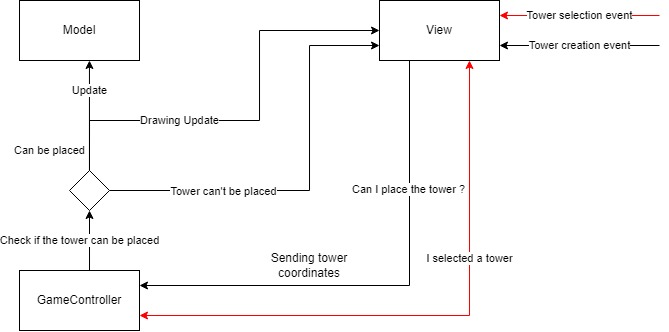
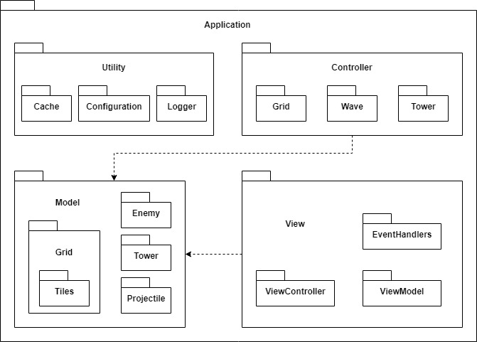

# Design

## Design architetturale
L'architettura dell'applicazione sviluppata è basata sul pattern *"Model-View-Controller"*, essendo questo uno dei maggiori pattern di riferimento per applicazioni
dotate di interfaccia grafica. Questa scelta architetturale ci può consentire di poter cambiare uno dei tre componenti principali senza dover riscrivere l'intera applicazione.

Una delle caratteristiche maggiori del paradigma funzionale è senz'altro una vera e propria immutabilità dei dati, per questo motivo, si è cercato di favorire il 
principio di *"favor immutability"*, questo si nota principalmente nelle classi di model, dove vengono prediletti oggetti immutabili.
Nonostante la modellazione di alcuni elementi in maniera immutabile fosse banale e naturale in certe situazioni, altre volte invece risultava più difficoltosa, come ad esempio nella modellazione della salute di un nemico, questa purtroppo è destinata a cambiare con il passare del tempo, in questo e pochi altri casi simili abbiamo
deciso di modellarli come elementi mutabili.

Essendo le entità del model immutabili, ci è venuto naturale modellare molti oggetti come case classe, relegando la logica complessiva in strutture di più alto livello, nel nostro caso sono i vari controller. E' presente una sorta di gerarchia tra i vari controller e nel più alto livello è presente il controller della 
view del main menù.
Questo genere di disaccoppiamento ha reso facile aggiungere modificare nuove funzionalità all'applicazione, sarà sufficiente aggiungere il relativo controller che dovrà essere messo nel posto giusto.

Partendo dai requisiti abbiamo dapprima sviluppato un diagramma che dovrebbe rappresentare il prototipo dell'applicazione, così da notare eventuali scelte incongruenti
o inconsistenti.

Di seguito invece è illustrato un prototipo del flusso delle azioni che si possono fare all'interno dell'applicazione.

Un'illustrazione di come avviene il principale processo del gioco: la selezione e il conseguente posizionamento di una torre.

## Design nel dettaglio

### Organizzazione dei package

### Componente "Model"
Questo componente contiene tutte le varie entità che sono presenti all'interno del gioco:
1. Tower
2. Enemie
3. Grid
4. Projectile
5. Player

Ognuna di queste classi contiene le definizioni di base di ogni entità che è presente all'interno dell'applicazione, ognuna modella il proprio comportamento in funzione di quello che deve fare e mantiene uno stato che sia capace di contenere le proprie informazioni più rilevanti.

### Componente "Controller"
Questo componente contiene tra le cose più importanti:
1. GameController (è il controller di un game all'interno dell'applicazione, al suo interno vengono usate quasi tutte le entità presenti nel model attraverso i propri controllers)
1. UpdateManager: si occupa in generale del game loop, quindi effettuare gli aggiornamenti all'interno del game

Tutte le altre classi di controller sono utilizzate all'interno di questi due controller.
Tutti i controller delle entità del model wrappano quelle stesse entità e offrono metodi avanzati per passare informazioni all'esterno.
L'unica eccezzione è DrawingManager, questa classe serve solamente per disegnare le entità all'interno della griglia e viene usata solamente da UpdateManager.
Come per il model, anche qui si è cercato di seguire, quando possibile, il principio di *"favor immutability"*

### Componente "View"
Questo componente è particolare, è presente un nuovamente un livello del pattern MVC, quindi abbiamo:
1. ViewModel: rappresenta tutta la grafica dell'applicazione e contiene tutte le definizioni delle interfacce grafiche
2. ViewController: rappresenta il controller del model, al suo interno contiene principalmente tutti gli event listener associati ai vari elementi del ViewModel e 
permette di eseguire le operazioni che l'utente fa sull'interfaccia grafica.

C'è un package, chiamato EventHandlers che serve a gestire nello specifico poi ogni singolo evento.

Come il resto, queste classi sono state scritte sempre seguento il principio di *"favor immutability"*, in particolare in questo caso ulteriormente tutte le classi sono private e l'unico modo per poter ottenere un tipo è sfruttando il trait, mentre per istanziare un'istanza è necessario sfruttare l'apply del companion object.
